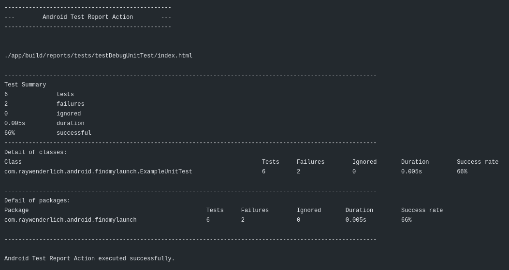
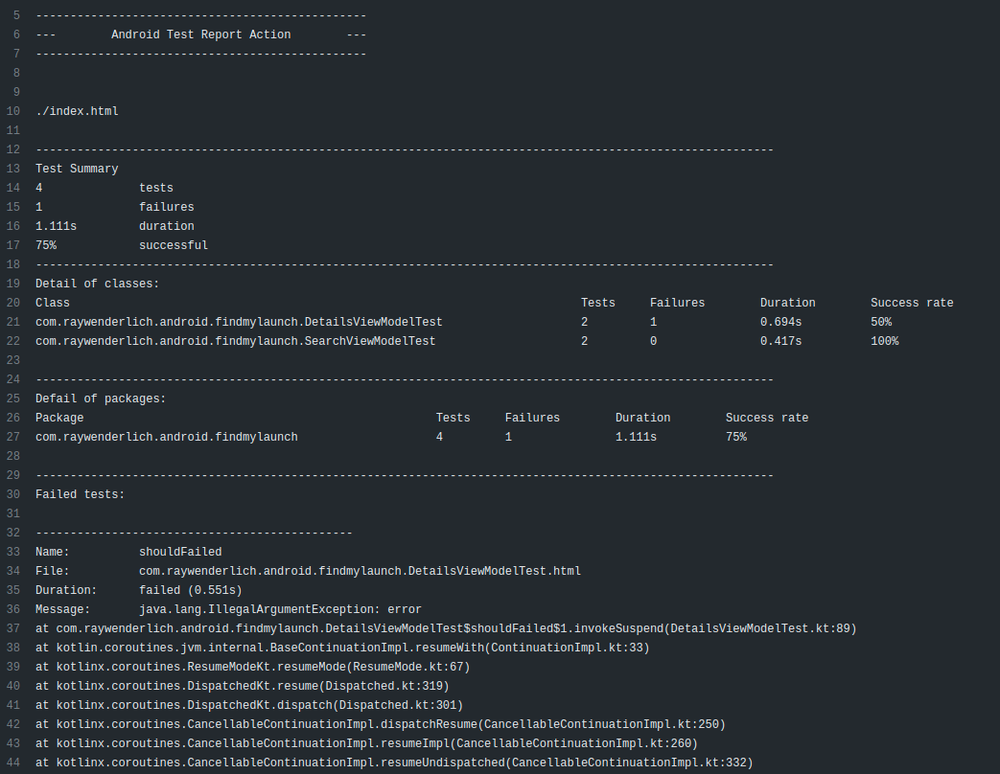

# Android Test Report Action

[](https://github.com/doanpt/AndroidTestReportAction/releases)
[](https://github.com/marketplace/actions/android-report-action)

GitHub Action that prints Android test xml reports.




<br>

## Getting Started

Add the following action to your GitHub Actions workflow.

```yml
- name: Android  Report Action
  uses: doanpt/AndroidTestReportAction@v1.0
```

<br>

## Usage

### Basic

Once the test command has been executed, the Android Test Report action will parse all of the XML reports and output the results in a structured way.

```yml
name: Test and deploy
on: [push]

jobs:
  test:
    runs-on: ubuntu-latest
    steps:# AndroidTestReportAction
parse test result for android test report

      - uses: actions/checkout@v2

      - name: Unit tests
        run: ./gradlew test # use can use another command to run juni test like: ./gradlew testDebugUnitTest
        continue-on-error: true # IMPORTANT: allow pipeline to continue to Android Test Report step

      - name: Make Unit test report
        uses: doanpt/AndroidTestReportAction@v1.0
        if: ${{ always() }} # IMPORTANT: run Android Test Report regardless
```
#### Note
The workflow must contain the unit test job prior to running the Android Test Report action. **The action will automatically pass or fail the job depending on the test results.**

<br>

### Alternate

If the basic usage fails to meet your requirement (running on MacOS machine or anything else), split the test and report into two jobs. The test job will run the tests and save the reports as artifacts. The report job will use the Android Test Report action to parse and print the results. Consider the following example below.

```yml
jobs:
  android_tests:
    runs-on: [ macos-latest ]
    steps:
      - uses: actions/checkout@v2

      - name: Instrumentation Tests
        uses: reactivecircus/android-emulator-runner@v2
        with:
          api-level: 29
          script: ./gradlew connectedAndroidTest
        continue-on-error: true # IMPORTANT: allow pipeline to continue to Android Test Report step
        
      - name: Upload Test Reports Folder
        uses: actions/upload-artifact@v2
        if: ${{ always() }} # IMPORTANT: Upload reports regardless of status
        with:
          name: reports
          path: app/build/reports/androidTests/connected/ # path to where the xml test results are stored

  ##5
  report:
    runs-on: [ ubuntu-latest ]
    needs: android_tests # The report job will run after test job
    if: ${{ always() }} # IMPORTANT: Execute report job regardless of status
    steps:
      - name: Download Test Reports Folder
        uses: actions/download-artifact@v2
        with:
          name: reports
      - name: Android  Report Action
        uses: doanpt/AndroidTestReportAction@v1.0
        if: ${{ always() }} # IMPORTANT: run Android Test Report regardless
```

<br>

## Output


<br>

## Sample Project

To learn how to use this action in an Android application, check out the following example repository:
https://github.com/doanpt/AndroidTestReportAction